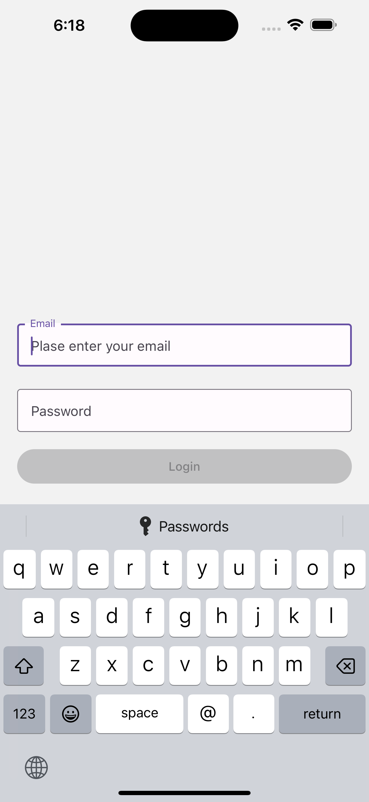

## Application details

1. Application is fetching the movies from API https://developer.themoviedb.org/reference/movie-popular-list
2. app uses redux/toolkit/query for api integration
3. app supports en and arabic language.
4. for localisation support react-i18next used
5. app uses redux and redux toolkit for application state management
6. app uses react-navigation/native-stack for navigation
7. graphQl demo repo url https://github.com/nikunjdhamat/exercise/tree/main/GraphQlDemo

## Follow the below steps to run the app

## Step 1: Install the node modules

```bash
# using npm
npm install

# for ios do pod install
npm run pod-install

# OR using Yarn
yarn install

```

## Step 2: Start your Application

### For Android

```bash
# using npm
npm run android

# OR using Yarn
yarn android
```

### For iOS

```bash
# using npm
npm run ios

# OR using Yarn
yarn ios
```

### Screenshots

## Login



## Movie List


## To Dos

1. unit test
2. code coverage
